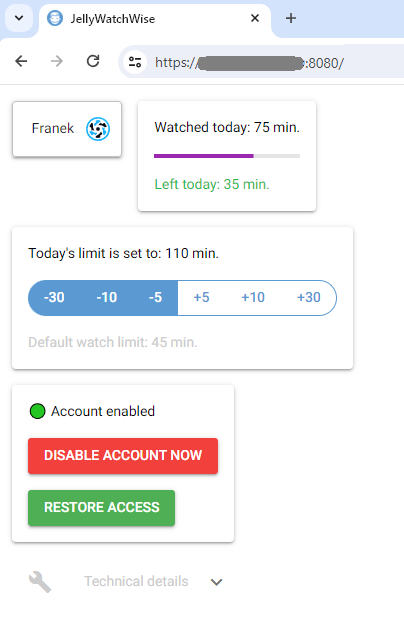

# JellyWatchWise <a href="https://www.buymeacoffee.com/jokerKP" target="_blank"></a>

JellyWatchWise is a Python application designed to help you manage and enforce watch time limits
for users accessing your Jellyfin media server. By integrating with the Jellyfin API, the app monitors
users' total watch time and restricts access to media libraries when their defined time limits are exceeded.

<table><tr><td valign="top">

## Features
* **Time limit for each user**

  Define separate time limits for each user to control their viewing habits.

* **Jellyfin integration**

  The app uses the Jellyfin API to monitor and manage user access.
* **GUI Management**

  Simple GUI for configuring time limits without additional logging in.

* **Requires Playback Reporting plugin**

  Requires the `Playback Reporting` plugin on your Jellyfin server.

</td><td>



</td></tr></table>


##  Why a standalone app instead of a Jellyfin plugin?

This project focuses on simplicity and ease of use.
The standalone app includes a GUI for quick access to time limit settings,
allowing you to adjust values without logging into the Jellyfin server.

## How to use it?

### Prerequisites
1. Ensure the `Playback Reporting` plugin is installed on your Jellyfin server.
2. Generate an **API Key** for JellyWatchWise from your Jellyfin admin account.

### Running with Docker
The easiest way to get started is by using Docker:

1. Pull the image

```bash
docker pull macjoker/jelly-watch-wise
```
2. Prepare configuration.

   Create a `config` folder with a `config.yaml` file.
   The file should include at least:
   * `host` - your Jellyfin server address
   * `token` - your Jellyfin API key.

   See sample config file in the repository for reference.


3. Run the container

```bash
docker run -d -v ./config:/app/config -t macjoker/jelly-watch-wise
```
The app will also store logs and backups of media folder UUIDs in the specified config folder.

## How does the lock work?
To apply time limits, ensure Enable All Folders is not selected for any user you wish to have limits applied.
Instead, manually select individual media folders available to each user.

**When time limit is exceeded**
the app unselects all media libraries for the user, effectively revoking access. Media currently playing will continue until the end, but no new media can be accessed.

**Immediate playback stop** is also possible.
The app includes buttons to immediately stop playback by disabling the user's account.
All connections of that user are then closed, and no logging in is possible until the account is enabled again.
